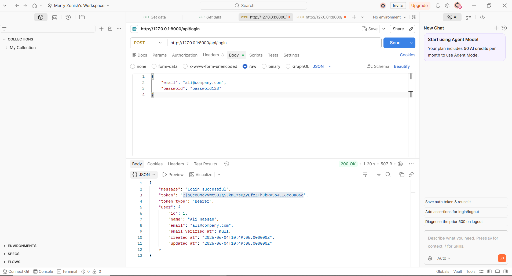
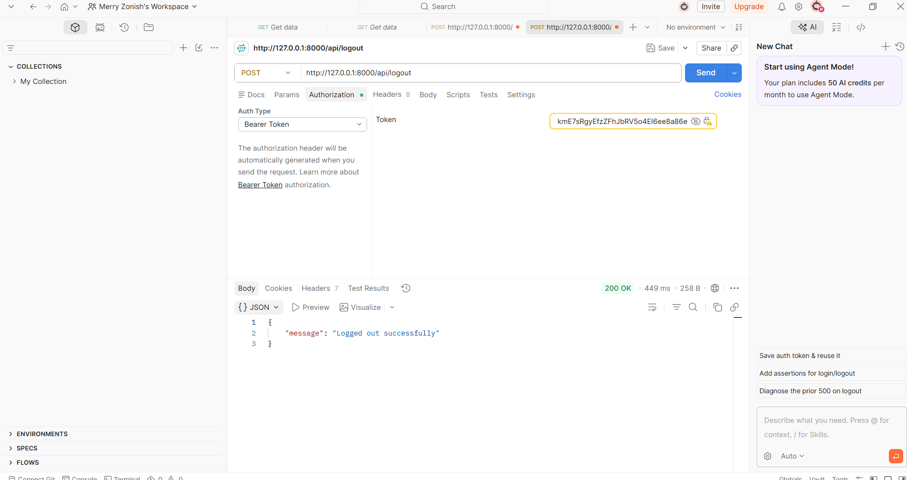

# Employee Tracker — Laravel Sanctum REST API

A secure, token-based REST API built with Laravel 13 and Laravel Sanctum for the Employee Tracker system. This API handles employee authentication and serves as the backend foundation for monitoring employee activity and screenshots.

---

## Tech Stack

| Technology | Purpose |
|------------|---------|
| Laravel 13 | PHP Backend Framework |
| Laravel Sanctum | API Token Authentication |
| MySQL | Database |
| PHP 8.4 | Programming Language |
| Composer | Dependency Manager |

---

## Setup Instructions

### 1. Clone the Repository
```bash
git clone https://github.com/merryzonish/employee-tracker.git
cd employee-tracker
```

### 2. Install Dependencies
```bash
composer install
```

### 3. Configure Environment
```bash
cp .env.example .env
php artisan key:generate
```

Update your `.env` file with database credentials:
```env
DB_CONNECTION=mysql
DB_HOST=127.0.0.1
DB_PORT=3306
DB_DATABASE=employee_tracker
DB_USERNAME=root
DB_PASSWORD=
```

### 4. Run Migrations
```bash
php artisan migrate
```

### 5. Seed the Database (10 Predefined Users)
```bash
php artisan db:seed
```

### 6. Start the Development Server
```bash
php artisan serve
```

Server will run at: `http://127.0.0.1:8000`

---

## API Endpoints

### Base URL
```
http://127.0.0.1:8000/api
```

---

### 1. Login

**Endpoint:** `POST /api/login`

**Description:** Authenticates a user and returns a Sanctum API token.

**Request Headers:**
```
Content-Type: application/json
Accept: application/json
```

**Request Body:**
```json
{
    "email": "ali@company.com",
    "password": "password123"
}
```

**Success Response** `200 OK`:
```json
{
    "message": "Login successful",
    "token": "1|your_generated_token_here",
    "token_type": "Bearer",
    "user": {
        "id": 1,
        "name": "Ali Hassan",
        "email": "ali@company.com",
        "email_verified_at": null,
        "created_at": "2026-06-04T10:49:05.000000Z",
        "updated_at": "2026-06-04T10:49:05.000000Z"
    }
}
```

**Error Response** `401 Unauthorized`:
```json
{
    "message": "Invalid credentials"
}
```

---

### 2. Logout

**Endpoint:** `POST /api/logout`

**Description:** Revokes the current user's API token.

**Request Headers:**
```
Authorization: Bearer {your_token_here}
Accept: application/json
```

**Success Response** `200 OK`:
```json
{
    "message": "Logged out successfully"
}
```

**Error Response** `401 Unauthorized`:
```json
{
    "message": "Unauthenticated."
}
```

---

## Authentication

This API uses Laravel Sanctum for token-based authentication.

1. Call `POST /api/login` with valid credentials
2. Copy the `token` from the response
3. Add it to the `Authorization` header of all protected requests:
```
Authorization: Bearer {your_token_here}
```

---

## Predefined Test Users

All users have the default password: `password123`

| # | Name | Email |
|---|------|-------|
| 1 | Ali Hassan | ali@company.com |
| 2 | Sara Khan | sara@company.com |
| 3 | Usman Ahmed | usman@company.com |
| 4 | Fatima Noor | fatima@company.com |
| 5 | Bilal Raza | bilal@company.com |
| 6 | Ayesha Malik | ayesha@company.com |
| 7 | Hamza Sheikh | hamza@company.com |
| 8 | Zara Hussain | zara@company.com |
| 9 | Omar Farooq | omar@company.com |
| 10 | Hina Baig | hina@company.com |

---

## Project Structure

```
employee-tracker/
├── app/
│   ├── Http/
│   │   └── Controllers/
│   │       └── AuthController.php   # Login & Logout logic
│   └── Models/
│       └── User.php                 # User model with Sanctum
├── database/
│   ├── migrations/                  # Database tables
│   └── seeders/
│       ├── DatabaseSeeder.php       # Runs all seeders
│       └── UserSeeder.php           # 10 predefined users
├── routes/
│   └── api.php                      # API routes
└── config/
    └── sanctum.php                  # Sanctum configuration
```

---

## Quick Command Reference

```bash
# Install dependencies
composer install

# Run migrations
php artisan migrate

# Seed database
php artisan db:seed

# Run migrations and seed together
php artisan migrate --seed

# Start server
php artisan serve
```

---


## Screenshots

### Login API



### Logout API



## Developer

**Merry Zonish**
GitHub: [@merryzonish](https://github.com/merryzonish)